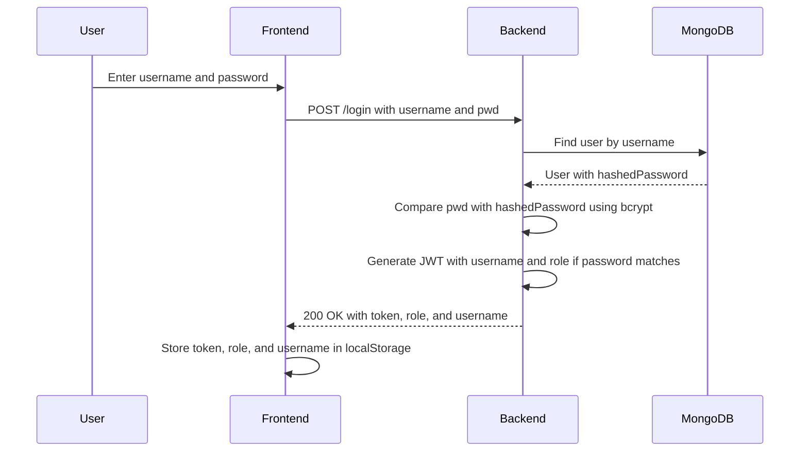
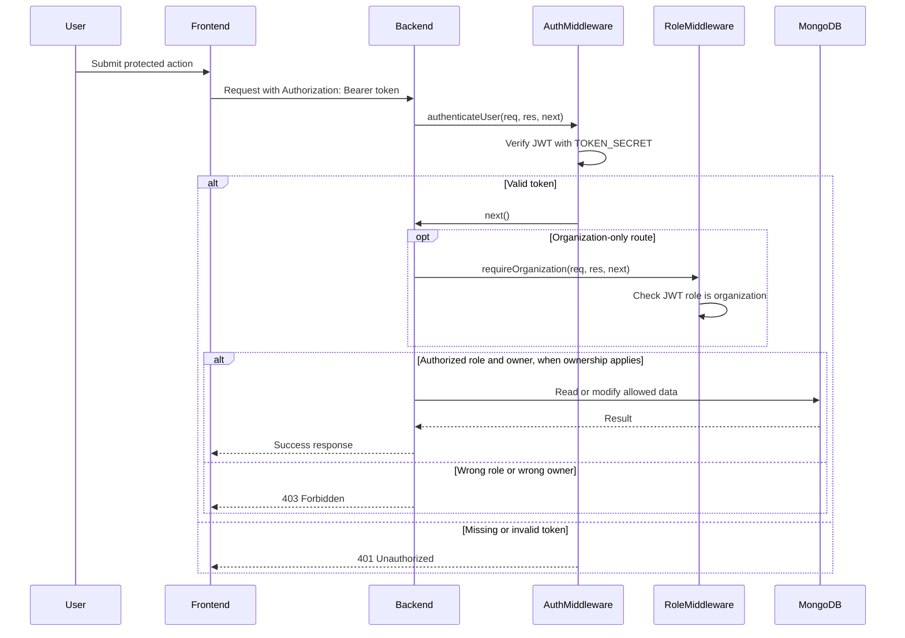

# Pet Adoption Match

Pet Adoption Match is a pet discovery and shelter management
app. Adopters can browse available pets, save favorites, view
detailed profiles, and submit adoption inquiries. Organization
accounts can create pet profiles, manage pet photos, and review
inquiries for pets they own.

Contributors:

- Stearman Rubey - Project Owner
- Jaydon Chen - Scrum Master
- Carlos Lopez - Lead Developer

## Current Product Behavior

### Adopter Experience

- Browse adoptable pets from the backend, with starter pet data
  shown when the backend pet collection is empty.
- Filter the discovery feed by species, size, and energy level.
- Open detailed pet profiles with galleries, shelter details,
  health notes, compatibility notes, and adoption fees.
- Save favorite pets in browser storage. Favorites persist
  locally, but they are not stored in MongoDB.
- Submit authenticated adoption inquiries with contact, housing,
  and message details.

### Organization Experience

- Sign up or log in as an organization account.
- Open the shelter portal to view pets owned by the current
  organization username.
- Expand the collapsed "Add pet profile" form only when creating
  a new pet.
- Create pet profiles with details, compatibility notes, health
  details, and multiple image URLs.
- Manage pet photos after creation.
- Review adoption inquiries for pets owned by the current
  organization.
- Filter the inquiry review dashboard by All, New, Contacted,
  Accepted, or Rejected.
- Update inquiry status from the dashboard. The UI label
  "Accepted" maps to the backend status value `approved`.

## Architecture

This repo is an npm workspace with two main packages:

- `packages/react-frontend`: React 19 + Vite single-page app
  using hash routes.
- `packages/express-backend`: Express API backed by MongoDB
  through Mongoose.

The backend exposes:

- `POST /signup` and `POST /login` for JWT-based authentication.
- `/pets` for public pet reads and organization-only pet
  creation, photo updates, availability updates, and deletion.
- `/inquiries` for authenticated inquiry creation and
  organization-only, owner-scoped inquiry review.
- `/orgs`, `/users`, and `/swipes` routes for the supporting
  data models.

MongoDB models are implemented for users, organizations, pets,
inquiries, and swipes. Security route behavior and model
relationship notes are maintained in
[`SECURITY_BEHAVIOR.md`](./SECURITY_BEHAVIOR.md).

## Setup

Install dependencies from the repo root:

```bash
npm install
```

Create a `.env` file at the repo root or in
`packages/express-backend` with:

```bash
MONGODB_URI=<your MongoDB connection string without the database name>
TOKEN_SECRET=<a local development JWT secret>
```

Optional:

```bash
MONGOOSE_DEBUG=true
VITE_API_BASE_URL=http://localhost:8000
```

The backend appends `primaryDB` to `MONGODB_URI`.

## Running Locally

Start the backend:

```bash
npm --workspace packages/express-backend run start
```

For backend development with auto-restart:

```bash
npm --workspace packages/express-backend run dev
```

Start the frontend on port `3100`:

```bash
npm start
```

The frontend uses `http://localhost:8000` as the default API
base URL. Override it with `VITE_API_BASE_URL` when needed.

## Testing And Verification

Run the main verification checks:

```bash
npm run lint
npm run build
```

Run Cypress E2E tests locally with MongoDB configured:

```bash
npm run test:e2e
```

Run deterministic Cypress story coverage without MongoDB:

```bash
npm run test:e2e:stories
```

Run all Cypress coverage:

```bash
npm run test:e2e:all
```

The Cypress suite covers:

- anonymous browsing preferences and local favorite persistence
- browsing filters, empty filtered results, and filter reset
- pet profile fallback text for missing optional values
- pet profile navigation from discovery and favorites
- auth role routing and organization-only screens
- authenticated adoption inquiry submission
- organization pet creation
- organization inquiry review and status updates
- multiple photo add, replace, remove, and gallery display
- recoverable feed and inquiry loading failures

## Deployment Notes

Frontend deployment target: Azure Static Web Apps or Vercel
static Vite deployment from `packages/react-frontend`.

Backend/API deployment target: Express app from
`packages/express-backend`, with `MONGODB_URI` and
`TOKEN_SECRET` configured in the deployment environment.

Live demo URL:
`https://polite-sea-04f9f5310.7.azurestaticapps.net`.

Live backend URL:
`https://gitgoblins-api-jaydonkc-bbbsbaeae4fhdfct.canadacentral-01.azurewebsites.net`.

Seed realistic demo records before presentation:

```bash
DEMO_PASSWORD="<temporary demo password>" npm run seed:demo
```

The seed script is idempotent and uses the deployed backend by
default. Override with `DEMO_API_BASE_URL` for another backend.
It creates or reuses these demo accounts:

- `central_coast_rescue` - organization account for Central
  Coast Pet Alliance
- `green_mesa_rescue` - organization account for Green Mesa
  Animal Rescue
- `maria_gonzalez_demo` - adopter account for inquiry submission

See
[`docs/FINAL_DELIVERY_RUNBOOK.md`](./docs/FINAL_DELIVERY_RUNBOOK.md)
for the final demo path, deployment variables, and known
blockers.

## Known Limitations

- Favorites are stored in browser localStorage, not MongoDB.
- Starter pet data appears only when backend pet records are
  empty; starter records are not automatically inserted into
  MongoDB.
- Image handling uses image URLs rather than file
  upload/storage.
- Swipe endpoints and user endpoints require authentication, but
  they are not yet scoped to the authenticated user's own
  records.
- Organization profile records and organization user accounts
  are separate. Shelter ownership checks use the pet
  `ownerUsername` set from the authenticated organization
  account.
- `GET /pets` is public and returns all pet records; the
  frontend filters adopted pets out of the discovery feed.
- The dev frontend script uses port `3100` with `--strictPort`,
  so an existing process on that port must be stopped before
  starting the app.

## Access Control Sequence Diagrams

### Sign Up Flow


### Login Flow



### Protected API Request Flow


