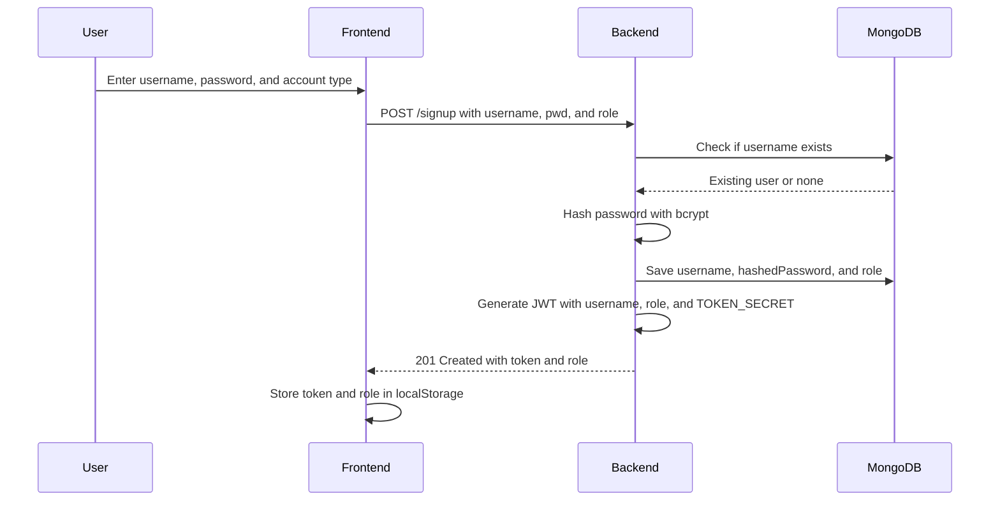
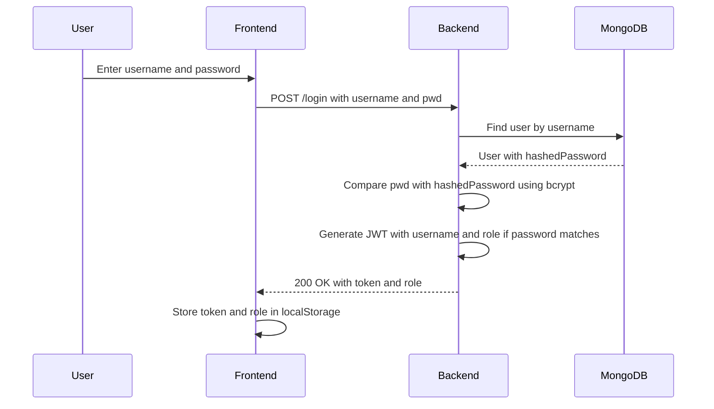
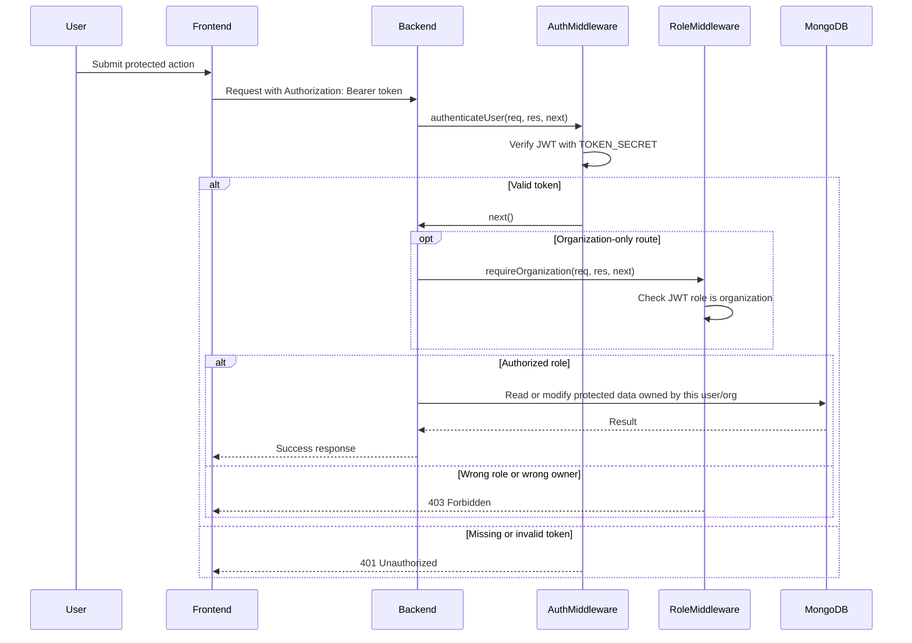

# Pet Adoption Match

In this project we will be making a web-app that allows people to find pets easier, and allows shelters to easily get their name out.

Contributors:
Stearman Rubey - Project Owner,
Jaydon Chen - Scrum Master,
Carlos Lopez - Lead Developer

## Running the MVP locally

```bash
npm install
npm start
```

The MVP frontend is a Vite React app in `packages/react-frontend`. It reads and writes pet profiles, inquiries, and photo updates through the Express backend. Favorites are still stored in browser storage because the current backend does not include a favorites model.

## Running the backend locally

From the repo root, start the backend with:

```bash
npm --workspace packages/express-backend run start
```

For development with auto-restart, use:

```bash
npm --workspace packages/express-backend run dev
```

The Express backend runs on <http://localhost:8000> and expects `MONGODB_URI` for MongoDB-backed routes. The frontend uses that URL by default; set `VITE_API_BASE_URL` if the API is running somewhere else.

## Testing

```bash
npm run build
npm run test:e2e
```

The Cypress E2E suite covers the Jaydon-authored flows:

- detailed pet profile from discovery and favorites
- save/favorite pet action
- adoption inquiry form with contact and housing information
- shelter pet creation
- multiple pet-photo add, replace, remove, and profile gallery display

## Deployable demo

Frontend deployment target: Vercel static Vite deployment from `packages/react-frontend`.

Backend/API deployment target: Express app in `packages/express-backend`, with MongoDB configured through `MONGODB_URI`.

Live demo URL: pending until the Vercel project is connected and the first production deployment is published.

If the backend pet collection is empty, the frontend shows starter pet data locally. Organization accounts can create pet records through the Express API so they are stored in MongoDB. The Express backend includes Mongo models and routes for pets, inquiries, organizations, users, and swipes.

Security Diagram:

## Access Control Sequence Diagrams

### Sign Up Flow



### Login Flow



### Protected API Request Flow


