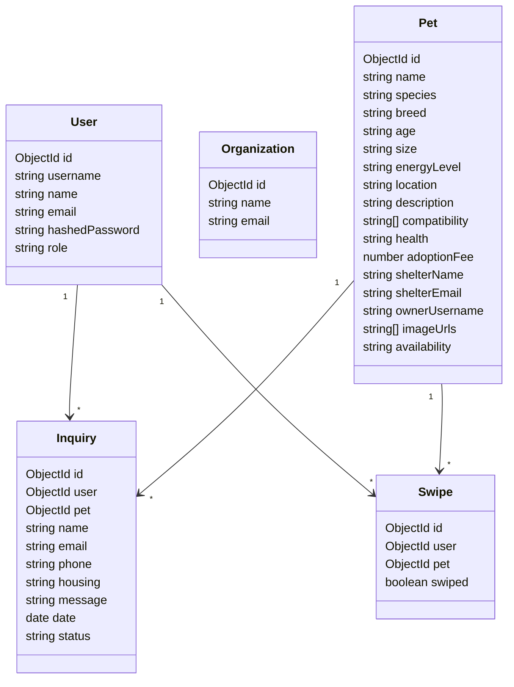
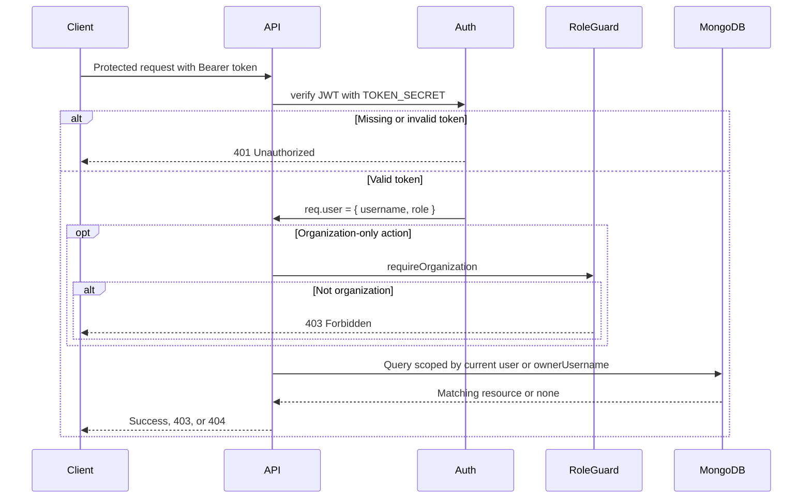

# Architecture and Software Design

## Overview

Pet Adoption Match is a small MERN-style application split into a Vite React frontend and an Express/Mongoose backend. The frontend talks to the backend over REST endpoints. MongoDB stores users, organizations, pets, swipes, and adoption inquiries.

## Stack

| Layer | Technology | Purpose |
| --- | --- | --- |
| Frontend | Vite, React, CSS | Browser app and user workflows |
| Backend | Express.js | REST API and auth middleware |
| Database | MongoDB via Mongoose | Persistent application data |
| Authentication | JWT, bcrypt | Login sessions and password hashing |
| Testing | Cypress, ESLint, Vite build | E2E and static verification |
| CI/CD | GitHub Actions, Azure Static Web Apps, Azure App Service | Automated verification and deployment |

## Package Structure

```text
packages/express-backend/
  auth.js                 # signup, login, JWT auth, role guard
  backend.js              # Express app composition
  config/database.js      # MongoDB connection
  models/                 # Mongoose schemas
  routes/                 # HTTP route handlers
  services/               # database access functions

packages/react-frontend/
  src/MyApp.jsx           # main React app and route views
  src/Login.jsx           # auth form
  src/main.css            # app styling

cypress/e2e/
  jaydon-flows.cy.js      # backend-backed E2E coverage
  user-stories.cy.js      # deterministic story coverage
```

## Data Model



## API Design

| Method | Path | Purpose | Access |
| --- | --- | --- | --- |
| `POST` | `/signup` | Create adopter or organization account | Public |
| `POST` | `/login` | Authenticate and receive JWT | Public |
| `GET` | `/pets` | List pet profiles for discovery | Public |
| `GET` | `/pets/discover/available` | List non-adopted pets | Public |
| `GET` | `/pets/:id` | View pet detail | Public |
| `POST` | `/pets` | Create pet profile | Organization |
| `PATCH` | `/pets/:id/photos` | Update pet gallery | Owning organization |
| `PATCH` | `/pets/:id/availability` | Update availability | Owning organization |
| `DELETE` | `/pets/:id` | Delete pet profile | Owning organization |
| `POST` | `/inquiries` | Submit inquiry | Authenticated user |
| `GET` | `/inquiries` | List inquiries for owned pets | Organization |
| `GET` | `/inquiries/:id` | View inquiry for owned pet | Organization |
| `PATCH` | `/inquiries/:id/status` | Update inquiry status for owned pet | Organization |
| `DELETE` | `/inquiries/:id` | Delete inquiry for owned pet | Organization |
| `GET` | `/users` | View current account | Authenticated user |
| `GET` | `/users/:id` | View own account by id | Same user |
| `DELETE` | `/users/:id` | Delete own account | Same user |
| `GET` | `/swipes` | List current user's swipes | Authenticated user |
| `POST` | `/swipes` | Create current user's swipe | Authenticated user |
| `GET` | `/swipes/:id` | View current user's swipe | Same user |
| `DELETE` | `/swipes/:id` | Delete current user's swipe | Same user |

## Access Control



## Design Tradeoffs

- Favorites and preferences are stored in browser storage for the MVP because they are adopter-local and do not require cross-device sync yet.
- Pet images use URLs rather than binary upload storage to keep the course project deployable without a separate object-storage service.
- The frontend is intentionally lightweight and mostly contained in one app file, while the backend has stricter module boundaries because routes, persistence, and authorization are easier to test and reason about separately.

## Deployment Notes

- Frontend is deployed as a static Vite app through Azure Static Web Apps.
- Backend is deployed as an Express app through Azure App Service.
- The deployed frontend is built with `VITE_API_BASE_URL` pointing to the Azure backend.
- Backend deployment requires `MONGODB_URI` and `TOKEN_SECRET`.
- Do not commit `.env` files or real credentials.
