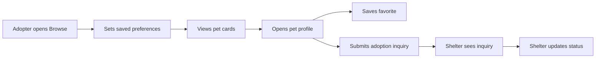

# UI Prototype and Storyboard

This document records the implemented UI direction for final project documentation.

- Figma/prototype URL: [PawPrint](https://www.figma.com/proto/3FXsFJZVXv26KCet3axnEQ/PawPrint?node-id=1-80&starting-point-node-id=1%3A80&t=o9IdVU9LA8iqE7MN-1)
- Last updated: June 5, 2026

## Visual Direction

Pet Adoption Match uses a calm, utilitarian adoption-workflow interface:

- Sticky top navigation with browse, favorites, auth, and shelter portal entry points.
- Discovery feed with pet cards, saved preference filters, and clear loading/empty/error states.
- Profile view with photo gallery, pet facts, compatibility notes, and inquiry form.
- Favorites view for saved pets.
- Shelter portal with pet creation, owned pet list, inquiry dashboard, and photo management.

## Storyboard

## Screen Inventory

### Browse Feed

Purpose: help adopters scan available pets and narrow by saved preferences.

Key elements:

- Hero summary and browse actions.
- Session/persistence indicator.
- Species, size, and energy preference controls.
- Pet card grid.
- Loading, empty, and recoverable API error states.

### Pet Profile

Purpose: provide enough detail to decide whether to save a pet or contact the shelter.

Key elements:

- Photo gallery with thumbnails.
- Description, location, health, compatibility, shelter contact, and adoption fee.
- Save pet action.
- Validated inquiry form.

### Favorites

Purpose: preserve adopter shortlist after refresh.

Key elements:

- Saved pet cards.
- Empty state when no pets are saved.
- Loading/error states if saved pet details are still loading.

### Shelter Portal

Purpose: allow organization users to publish pets and manage adopter follow-up.

Key elements:

- Validated pet profile form.
- Organization-owned pet list.
- Inquiry dashboard scoped to pets owned by the current organization account.
- Inquiry status select.

### Photo Manager

Purpose: let shelters keep pet galleries current.

Key elements:

- Editable image URL list.
- Add/remove photo controls.
- Gallery preview.

## Responsive Behavior

- Main grids collapse to one column on smaller screens.
- Forms remain full-width and use stacked fields on mobile.
- The sticky profile action panel becomes static on narrow screens.

## Intentional Differences From Full Product Vision

- The MVP uses a grid feed rather than physical swipe gestures to keep the demo reliable.
- Pet photos use image URLs instead of upload storage.
- Favorites and preferences use browser storage instead of cross-device accounts.
- External shelter integrations are deferred.
